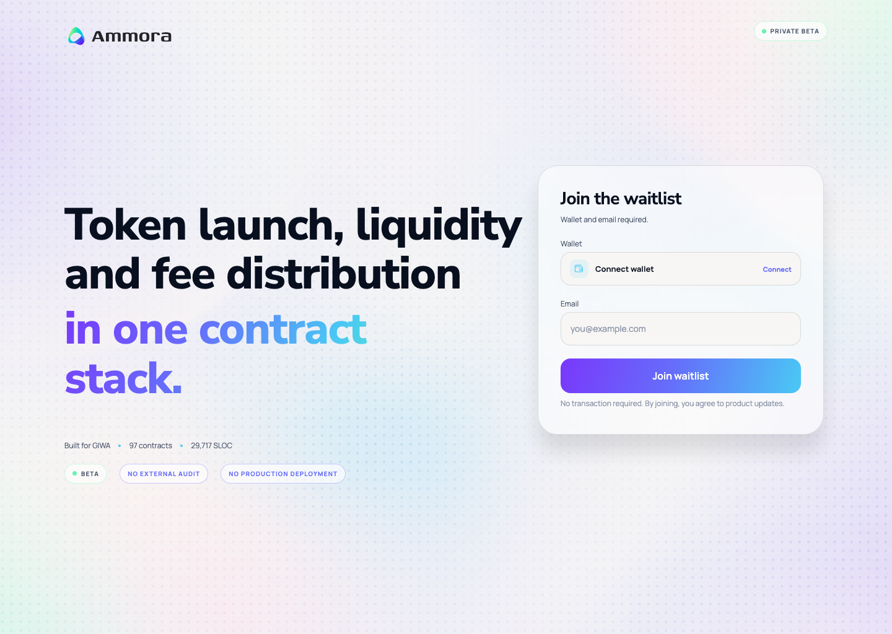

# Ammora Waitlist Frontend

Ammora private waitlist의 반응형 정적 프론트엔드 UI다. 기존 사이트와 분리된 독립 프로젝트이며 별도 빌드 의존성이 없다.



## 실행

요구사항: Node.js 18 이상

```bash
npm run check
npm run dev
```

브라우저에서 `http://127.0.0.1:4178`을 연다. 다른 포트를 사용하려면 `PORT=8080 npm run dev`처럼 실행한다.

외부 artifact 공유용 단일 HTML은 다음 명령으로 다시 생성한다.

```bash
npm run build:share
```

## 현재 구현 범위

- Desktop 1440px 기준 Figma 레이아웃
- Mobile 390px 반응형 레이아웃
- Nunito Sans / Manrope 로컬 웹폰트
- Aurora dot 배경 이미지
- Fine pointer 환경의 300px interactive spotlight
- Email focus 단일 color stroke
- 모바일 facts/status horizontal overflow
- Wallet, email, CTA는 UI만 구현되어 있으며 실제 제출 기능은 연결하지 않음

## 백엔드 연결 지점

- Wallet trigger: `#wallet-button`
- Email field: `#email`
- Submit trigger: `.join-button`

실제 연동 시 다음 처리가 필요하다.

1. Wallet provider SDK 연결
2. 이메일 형식 및 wallet 연결 상태 검증
3. Waitlist API 제출과 loading/error/success state
4. 개인정보 처리 동의 및 운영 환경의 abuse protection

## 프로젝트 구조

```text
.
├── index.html
├── design-system.css
├── styles.css
├── background-interaction.js
├── assets/
│   ├── background-aurora-dots.png
│   ├── fonts/
│   └── logos/
├── docs/
│   ├── DESIGN-SYSTEM.md
│   └── preview-*.png
└── scripts/
    ├── check.mjs
    └── dev-server.mjs
```

## 배포

모든 asset path가 상대 경로이므로 GitHub Pages의 repository subpath에서도 동작한다.

### GitHub

```bash
git init
git add .
git commit -m "feat: add Ammora waitlist frontend"
git branch -M main
gh repo create ammora-waitlist-frontend --private --source=. --remote=origin --push
```

그다음 GitHub repository의 `Settings → Pages → Deploy from a branch`에서 `main / (root)`를 선택한다. 공개 저장소가 필요하면 `--private` 대신 `--public`을 사용한다.

### Vercel / Netlify

- Framework preset: `Other` 또는 `Static`
- Build command: 없음
- Output / publish directory: `.`

## 디자인 참조

- Figma: <https://www.figma.com/design/8W9MlHSeEpNVNl2R0WdP7C/Untitled?node-id=13-174>
- 상세 token 및 interaction 규칙: [`docs/DESIGN-SYSTEM.md`](./docs/DESIGN-SYSTEM.md)
